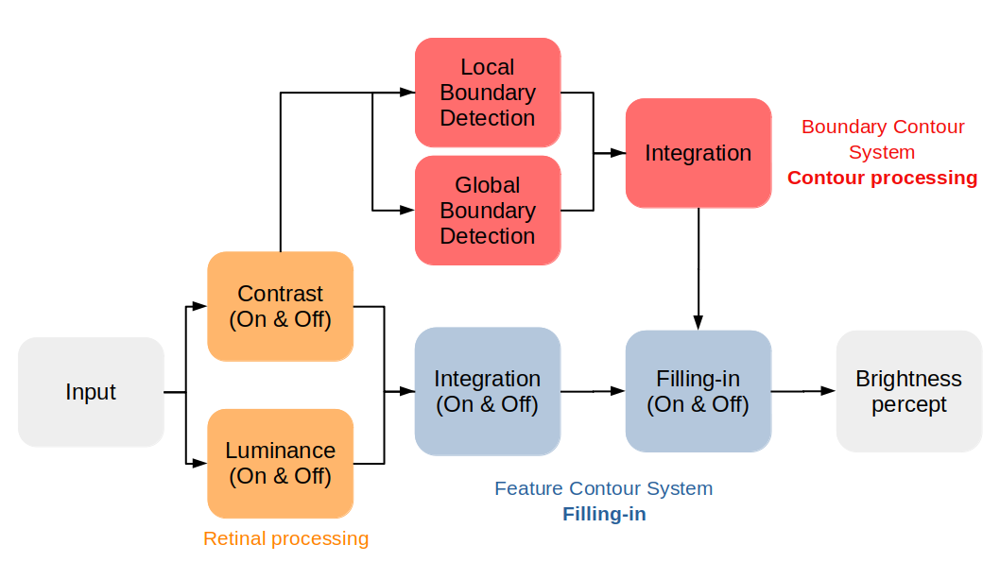
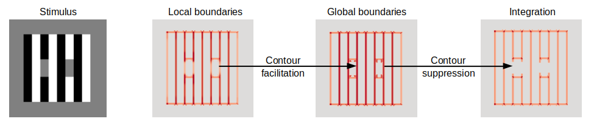
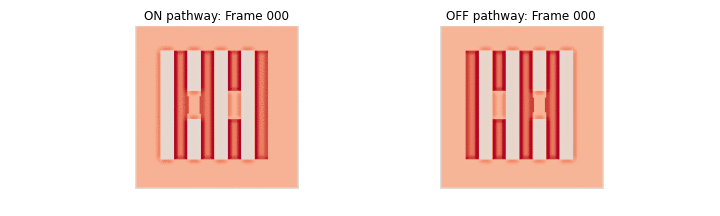

# Re-implementation of Domijan's (2015) brightness perception model

## Description

This repository contains a re-implementation of the physiologically-inspired brightness perception model presented in Domijan (2015): [A Neurocomputational account of the role of contour facilitation in brightness perception](https://www.ncbi.nlm.nih.gov/pmc/articles/PMC4333805/). It can be used to reproduce all its results.

## Installation
To install this package, you need to clone this repository and run `pip install .` (or `pip3 install .`) inside this directory or run `python setup.py install` (or `python setup.py develop` for developer mode).

## Files and Usage

* `demo/model_walkthrough.ipyb`:
This Jupyter Notebook tries to provide a deeper understanding of the brightness perception model by visualizing and commenting on each processing step.

* `demo/demo.py`:
This script will run the model on all the stimuli from the Domijan 2015 paper and save the outputs in a `model_outputs` directory
  

* `domijan2015/main.py`:
This module contains the main function for running the model. It depedends on other modules inside the `domijan2015` directory.
  

## Model overview
The proposed brightness perception model can account for a variety of different brightness illusions. An overview of the model structure is given in the following Figure: 

Based on earlier work by [Grossberg and Todorovic (1988)](https://link.springer.com/article/10.3758/BF03207869), the basic idea of this model is that the brightness percept arises from the interaction between two parallel processing streams which are called the Boundary Contour System (BCS) and the Feature Contour System (FCS). The BCS consists of orientation- and contrast-sensitive nodes that extract and process contour-related information. Likewise, the BCS generates an Edge Map that serves as a Boundary signal for the FCS. In the FCS, activation spreads laterally within these boundaries generating a filling-in of activation between neighboring nodes. Empirical evidence for such filling-in models can be found in experiments by [Paradiso and Nakayama (1991)](https://www.sciencedirect.com/science/article/abs/pii/0042698991900479) or recent contour adaptation experiments by [Anstis (2013)](https://jov.arvojournals.org/article.aspx?articleid=2193818)

Due to the importance of the Boundary signal, a major focus of the model lies on how contour information is processed. A simple idea is proposed in which neural responses to low-contrast contours get enhanced in the presence of collinear or parallel high-contrast contours in the surround. In his paper, [Domijan (2015)](https://www.ncbi.nlm.nih.gov/pmc/articles/PMC4333805/) refers to this process as "contour facilitation". However, this contour facilitation in the Global Boundary signal leads to the suppression of these contours in the resulting integrated Edge Map, here exemplarily shown for White's illusion: 

Interestingly, this contour suppression in the integrated Edge Map is in line with another contour-related explanation given by [Betz, Shapley, Wichmann, and Maertens (2015)](). Based on contour adaptation experiments with White's illusion, they propose iso-orientation surround suppression (IOSS) as mechanism that could explain brightness perception in White's illusion. The basic idea is that responses to target contours that are in line with the grating get inhibited by the responses to collinear grating contours (see following Figure). The contours orthogonal to the grating are unaffected by this surround suppression, since there are no collinear contours in their surround. The resulting asymmetry between the parallel and orthogonal target contours is proposed as the foundation to explain White's illusion. 

Filling-in is implemented independently for ON and OFF Filling-in pathways (for details see the Jupyter Notebook). Importantly, the suppression of contours in the BCS output leads to a filling-in of the brightness signal specifically across these suppressed contours (see following videos). The resulting interaction between brightness assimilation opposes local contrast effects, and enables the model to account for all proposed brightness illusions. Importantly, the assimilation effect will only occur along low-contrast edges which are collinear or parallel with a high-contrast edge. In a final step which is not shown here, the outputs of the FCS will be integrated into the final brightness percept. 

## Author and acknowledgments
All scripts and the Jupyter notebook were written by Lynn Schmittwilken (l.schmittwilken@tu-berlin.de). We would like to thank Drazen Domijan for all his support and for kindly providing us with his MATLAB scripts.
